# 🔐 **PolyDefense** - A Hybrid SSL Authentication System

A secure, flexible authentication system using public key cryptography and challenge-response protocol for server-to-server communication where true mTLS is not possible because access to the webserver configuration is not an option, like in shared hosting environments for example.

## 📖 Overview

This system provides robust mutual authentication between a client and server in PHP, using a hybrid approach that combines the best aspects of certificate-based and public key authentication, after passing the ip whitelist as a first line defense. It uses a challenge-response protocol with digital signatures to ensure both parties can verify each other's identity without shared secrets.


## ✨ Features

- **Core Authentication Features**

  - ✅ **Hybrid SSL Authentication** - Combines certificate-based and public key authentication
  - ✅ **Mutual Authentication** - Both client and server verify each other's identity
  - ✅ **Challenge-Response Protocol** - Time-limited signed challenges prevent replay attacks
  - ✅ **Dual Verification Methods** - Supports both client certificates and raw public keys
  - ✅ **Flexible Authentication** - Configurable to use certificates, public keys, or both

  ### **Security & Access Control**

  - ✅ **IP Whitelisting** - First-line defense with CIDR block support
  - ✅ **Certificate Fingerprint Validation** - SHA256 fingerprint matching for client certificates
  - ✅ **Common Name Validation** - Verifies client certificate CN matches expected value
  - ✅ **Certificate Expiry Checking** - Validates certificate validity periods
  - ✅ **Rate Limiting** - Configurable request limits with successful auth exemptions
  - ✅ **Replay Attack Protection** - Time-bound challenges with server signatures

  ### **Input Validation & Sanitization**

  - ✅ **Strict Base64 Validation** - Proper padding and character set validation
  - ✅ **JSON Input Validation** - Secure JSON parsing with size limits
  - ✅ **Filename Security** - Prevents directory traversal attacks
  - ✅ **Size Limit Enforcement** - Configurable maximums for all inputs
  - ✅ **Signature Format Validation** - Ensures proper signature encoding and length

  ### **DoS Protection & Rate Limiting**

  - ✅ **Request Rate Limiting** - Per-client request limits with time windows
  - ✅ **Storage-Based DoS Protection** - Hard limits on total storage and file counts
  - ✅ **Automatic Storage Cleanup** - Self-maintaining system deletes oldest files at thresholds
  - ✅ **File Size Limits** - Individual files limited to prevent resource exhaustion
  - ✅ **Concurrent Request Protection** - File locking prevents race conditions

  ### **Secure Storage Management**

  - ✅ **HMAC Integrity Protection** - SHA256 HMAC verification for all stored files
  - ✅ **Automatic Maintenance** - Self-cleaning when storage reaches 80% capacity
  - ✅ **Tamper Detection** - Corrupted or modified files automatically deleted
  - ✅ **Compression Support** - Optional GZIP compression for storage efficiency
  - ✅ **Secure File Locking** - Prevents race conditions in concurrent environments
  - ✅ **Storage Monitoring** - Real-time usage tracking and automatic alerts

  ### **Certificate Management**

  - ✅ **Certificate Expiry Monitoring** - Tracks certificate validity periods
  - ✅ **Automated Email Alerts** - Notifications before certificate expiry
  - ✅ **Fingerprint Validation** - SHA256 certificate fingerprint verification
  - ✅ **Flexible Certificate Support** - Works with both PEM certificates and public keys

  ### **Operational & Monitoring Features**

  - ✅ **Environment Variable Support** - Flexible configuration management
  - ✅ **Comprehensive Debug Logging** - Detailed logging for troubleshooting
  - ✅ **Production-Ready Defaults** - Secure configurations with development flexibility
  - ✅ **Web Server Agnostic** - Works with any PHP-enabled web server
  - ✅ **Timing Statistics** - Debug endpoint for performance monitoring
  - ✅ **Error Handling** - Custom exceptions with secure error responses

  ### **Cryptographic Security**

  - ✅ **Public Key Cryptography Only** - No shared secrets in the system
  - ✅ **Server-Signed Challenges** - Challenges signed with server private key
  - ✅ **Client Signature Verification** - Verifies client signatures with public key/certificate
  - ✅ **Secure Random Generation** - Cryptographically secure challenge generation
  - ✅ **HMAC Integrity Protection** - Additional integrity layer for all data

  ### **Configuration & Flexibility**

  - ✅ **Modular Configuration** - Easy-to-update configuration section
  - ✅ **Development/Production Modes** - Debug mode for testing, secure mode for production
  - ✅ **Customizable Thresholds** - Configurable limits, timeouts, and thresholds
  - ✅ **Email Alert Customization** - Configurable alert thresholds and email settings

  ### **API Features**

  - ✅ **RESTful Endpoints** - GET for challenges, POST for authentication
  - ✅ **JSON Responses** - Consistent JSON output format
  - ✅ **HTTP Status Codes** - Proper status codes for different error conditions
  - ✅ **Security Headers** - Comprehensive security headers in responses

  

## 🏗️ Architecture

### How It Works

```mermaid
sequenceDiagram
    participant Client
    participant Server

    Note over Client,Server: 🔒 DEFENSE LAYER 1: IP Access Control
    Client->>Server: Initial Request
    Server->>Server: IP Whitelist Validation
    alt IP Not Allowed
        Server->>Client: 403 Access Denied
        Note over Server: IPAccessException
    end

    Note over Client,Server: 🔒 DEFENSE LAYER 2: Rate Limiting
    Server->>Server: Check Rate Limits
    alt Rate Limit Exceeded
        Server->>Client: 429 Too Many Requests
        Note over Server: RateLimitException
    end

    Note over Client,Server: 🔒 DEFENSE LAYER 3: Input Validation
    Server->>Server: SecurityValidator::validateJsonInput()
    alt Invalid Input
        Server->>Client: 400 Bad Request
        Note over Server: ValidationException
    end

    Note over Client,Server: 🔐 HYBRID AUTHENTICATION FLOW

    Client->>Server: GET /server.php (Request Challenge)
    Server->>Server: SecureStorageManager::enforceStorageLimits()
    Server->>Server: HybridAuthenticator::generateChallenge()
    Note over Server: Creates: random nonce + timestamp + expiry<br/>Signs with server private key<br/>Adds HMAC integrity protection
    Server->>Client: JSON Response: Signed Challenge + HMAC

    Client->>Server: POST /server.php (Authentication)
    Note over Client: Signs challenge with client private key<br/>Optionally includes client certificate
    Server->>Server: SecurityValidator::validateChallenge()
    Server->>Server: SecurityValidator::validateSignature()
    Server->>Server: HybridAuthenticator::verifyChallengeResponse()
    
    Note over Server: Challenge Verification Steps:
    Server->>Server: 1. HMAC integrity check
    Server->>Server: 2. Challenge expiry validation
    Server->>Server: 3. Server signature verification
    Server->>Server: 4. Client signature verification
    
    alt Certificate Provided
        Server->>Server: Certificate Validation:
        Server->>Server: - Common Name (CN) check
        Server->>Server: - Fingerprint validation
        Server->>Server: - Expiry check
        Server->>Server: CertificateExpiryMonitor::checkAndAlert()
    else No Certificate
        Server->>Server: Verify with client public key file
    end

    alt Authentication Successful
        Server->>Server: RequestRateLimiter::recordSuccessfulAuth()
        Server->>Server: SecureStorageManager::writeFile()
        Server->>Client: 200 Success + Authentication Token
    else Authentication Failed
        Server->>Client: 401 Unauthorized
    end

    Note over Client,Server: 🔒 DEFENSE LAYER 4: Secure Storage
    Note over Server: All data stored with:<br/>- File locking<br/>- HMAC integrity<br/>- Compression<br/>- Automatic cleanup
```




## 🚀 Quick Start

### Prerequisites

- PHP 8.0+ with OpenSSL extension
- Web server (Apache/Nginx) with SSL/TLS
- OpenSSL command line tools

### 1. Certificate Generation

Generate all required certificates and keys:

```bash
# Create certificates directory
mkdir -p keys
cd keys

# Generate Certificate Authority
openssl genrsa -out ca.key 4096
openssl req -new -x509 -days 3650 -key ca.key -out ca.crt -subj "/C=US/ST=State/L=City/O=Organization/CN=Test CA"

# Generate Server Certificate
openssl genrsa -out server.key 4096
openssl req -new -key server.key -out server.csr -subj "/C=US/ST=State/L=City/O=Organization/CN=server.example.com"
openssl x509 -req -days 365 -in server.csr -CA ca.crt -CAkey ca.key -CAcreateserial -out server.crt
openssl rsa -in server.key -pubout -out server.pub

# Generate Client Certificate
openssl genrsa -out client.key 4096
openssl req -new -key client.key -out client.csr -subj "/C=US/ST=State/L=City/O=Organization/CN=secure-client"
openssl x509 -req -days 365 -in client.csr -CA ca.crt -CAkey ca.key -CAcreateserial -out client.crt
openssl rsa -in client.key -pubout -out client.pub

# Set secure permissions
chmod 600 *.key
chmod 644 *.crt *.pub

# Clean up
rm -f *.csr *.srl

# Show fingerprint and ClientCN from the generated client key. Copy them into server.php
php fingerprint.php client.crt
```


### 2. Server Setup

1. **Upload server files:**

   ```
   /var/www/secure-auth/
   ├── server.php
   ├── keys/
   │   ├── server.key
   │   ├── server.crt
   │   └── client.pub
   ├── locks/ (auto-created)
   └── rate_limits/ (auto-created)
   ```

   

2. **Configure environment variables**:

   ```bash
   # In your server's PHP environment
   # Path configuration. Place outside of webroot if possible
   $serverPrivateKeyPath = $_ENV['AUTH_SERVER_PRIVATE_KEY_PATH'] ?? './keys/server.key';
   $clientPublicKeyPath = $_ENV['AUTH_CLIENT_PUBLIC_KEY_PATH'] ?? './keys/client.pub';
   
   # Show fingerprint and ClientCN from the client certificate with fingerprint.php
   $requiredClientCN = 'secure-client';    # Expected Common Name in client certificate
   $expectedClientCertFingerprint = $_ENV['AUTH_CLIENT_CERT_FINGERPRINT'] ?? 'a71b86718fe3456fe46cbc4bad1baa4adc0952530a5f6053a246997783e476f'; 
   
   $ipAccessControlEnabled = false; # Enable/disable IP whitelist
   $allowedIPs = [
       '192.168.1.100',           # Single IP
       '10.0.0.0/24',             # CIDR block
       '172.16.0.0/16',           # Larger network block
       '127.0.0.1',               # Localhost
       '::1'                      # IPv6 localhost
   ];
   # Email alerts for certificate expiry
   $checkCertificateExpiry = true;
   $emailAlertsEnabled = true;
   
   # !!! SET TO FALSE IN PRODUCTION! !!!
   $debugMode = true; 
   
   # Rate limiting
   $maxRequestsPerMinute = 60;                         # Requests per IP per minute
   $maxConsecutiveFailures = 5;                        # Max failures before blocking
   $failureWindow = 900;                               # 15 minute failure window
   $blockDuration = 1800;                              # 30 minute block duration
   ```


**Monitoring**
In debug mode, the server returns the timing statistics:

```html
https://domain.com/auth/server2.php?action=timing_stats
```


### 3. Client Setup

1. **Create client directory:**

   ```
   /path/to/client/
   ├── client.php
   └── keys/
       ├── client.key
       ├── server.pub
       └── client.crt
   ```

   

2. **Configure environment variables**:

   ```bash
   # In your client's environment
   # Place outside of webroot if possible
   $clientPrivateKeyPath = $_ENV['AUTH_CLIENT_PRIVATE_KEY_PATH'] ?? './keys/client.key';
   $serverPublicKeyPath = $_ENV['AUTH_SERVER_PUBLIC_KEY_PATH'] ?? './keys/server.pub';
   $clientCertificatePath = $_ENV['AUTH_CLIENT_CERTIFICATE_PATH'] ?? './keys/client.crt';
   
   # The URL of your server script.
   $serverUrl = $_ENV['AUTH_SERVER_URL'] ?? 'https://domain.com/auth/server.php';
   
   # Security settings
   $verifyPeer = false;                                // Set to true in production
   $verifyPeerName = false;                            // Set to true in production
   
   # !!! SET TO FALSE IN PRODUCTION! !!!
   $debugMode = true;                                  // Set to false in production
   ```

   


## 💾 Storage Management

The system includes comprehensive storage management to prevent DoS attacks and ensure optimal performance:

### Storage Configuration (server.php)

```php
// Storage configuration
$storagePath = './storage';                         // Secure storage directory
$maxStorageSize = 100 * 1024 * 1024;               // 100MB total storage limit
$maxFileCount = 10000;                             // Maximum 10,000 files
$maxFileSize = 100 * 1024;                         // 100KB per file limit
$cleanupThreshold = 0.8;                           // Cleanup at 80% capacity
```


**Monitoring**
In debug mode, the server logs storage usage:

```
STORAGE_DEBUG: Storage usage: 15.25 MB / 100 MB (15.25%), 150 / 10000 files
```


## Storage Architecture

```
/storage/
├── rate_limit_[hash].dat    # Rate limit data (HMAC protected)
├── (other system files)     # All with integrity protection
└── (auto-cleaned)           # Oldest files deleted automatically
```


## 💡 Use Cases & Examples

### Example 1: Microservice Authentication

**Scenario**: Secure communication between internal microservices


```php
// Service A needs to call Service B securely
$client = new HybridAuthClient(
    '/etc/secrets/service-a.key',
    '/etc/secrets/service-b.pub',
    'https://service-b.example.com/auth'
);

$result = $client->authenticateAndGetData();
if ($result['status'] === 'success') {
    // Now make authenticated API calls to Service B
    $apiData = $result['data'];
    // Proceed with business logic...
}
```


### Example 2: Automated System Integration

**Scenario**: Secure data exchange between business partners


```php
// Company A's system needs to pull data from Company B's API
$client = new HybridAuthClient(
    '/opt/company-a/auth/client.key',
    '/opt/company-a/auth/company-b.pub',
    'https://api.company-b.com/secure-endpoint'
);

try {
    $result = $client->authenticateAndGetData();
    if ($result['status'] === 'success') {
        $sensitiveData = $result['data'];
        // Process the securely received data
        processBusinessData($sensitiveData);
    }
} catch (Exception $e) {
    log_error("Authentication failed: " . $e->getMessage());
    alert_administrator("Integration authentication failure");
}
```


### Example 3: IoT Device Authentication

**Scenario**: Secure communication with IoT devices


```php
// IoT device authenticating with central management system
$client = new HybridAuthClient(
    '/var/iot/device.key',
    '/var/iot/management-system.pub',
    'https://iot-management.example.com/api/v1/authenticate'
);

$result = $client->authenticateAndGetData();
if ($result['status'] === 'success') {
    // Device is authenticated, proceed with secure operations
    $deviceToken = $result['data']['access_token'];
    uploadTelemetryData($deviceToken, $sensorReadings);
}
```


## 🔧 Advanced Configuration

### Production Deployment Checklist

- Set `$debugMode = false` on both client and server
- Set `$verifyPeer = true` and `$verifyPeerName = true` on client
- Configure proper file permissions (600 for private keys, 644 for public keys/certs)
- Set up monitoring for rate limit events
- Configure email alerts for certificate expiry
- Implement proper logging and alerting
- Set up certificate rotation procedure

### Storage & Security Checklist

```markdown
- [ ] Configure appropriate storage limits for expected load
- [ ] Monitor storage usage in debug mode initially
- [ ] Ensure storage directory has proper filesystem permissions
- [ ] Verify automatic cleanup is functioning
- [ ] Test HMAC integrity protection
- [ ] Validate file locking under concurrent load
```


### Environment Variables for Docker/Kubernetes

```bash
# Server environment
AUTH_SERVER_PRIVATE_KEY_PATH=/run/secrets/server-key
AUTH_CLIENT_PUBLIC_KEY_PATH=/run/secrets/client-pub
AUTH_SERVER_URL=https://auth.example.com/server.php

# Client environment  
AUTH_CLIENT_PRIVATE_KEY_PATH=/run/secrets/client-key
AUTH_SERVER_PUBLIC_KEY_PATH=/run/secrets/server-pub
AUTH_CLIENT_CERTIFICATE_PATH=/run/secrets/client-cert
```


## 🚨 Troubleshooting

### Common Issues and Solutions

**1. "Failed to load private key"**

- Check file permissions (should be 600)
- Verify the key file exists and is readable
- Ensure OpenSSL extension is installed

**2. "Rate limit exceeded"**

- Client is making requests too quickly
- Check server rate limiting configuration
- Implement exponential backoff in client

**3. "Challenge expired"**

- Server and client clocks are out of sync
- Check NTP synchronization
- Increase `$challengeTimeout` if needed

**4. "Invalid signature"**

- Key mismatch between client and server
- Regenerate and redistribute keys
- Verify the correct public key is being used

**5. "No client certificate presented"**

- Client certificate not being sent or received
- Check web server SSL configuration
- Verify client includes certificate in request

**6. "Storage limit exceeded" errors**
- **Cause**: Storage has reached configured limits
- **Solution**: System automatically cleans up, but you can:
  - Increase `$maxStorageSize` if needed
  - Check for unusually high request rates
  - Verify automatic cleanup is working

**7. "HMAC verification failed"**
- **Cause**: Stored data has been corrupted or tampered with
- **Solution**: System automatically deletes corrupted files
  - Check filesystem integrity
  - Verify no manual file modifications
  - Monitor for potential security issues

**8. "Invalid filename" errors**
- **Cause**: Attempted directory traversal or invalid characters
- **Solution**: Security feature working correctly
  - No action needed - attack was prevented
  
  

### Debug Mode

Enable debug mode for detailed troubleshooting:

```php
$debugMode = true;
```

This will provide:

- Detailed step-by-step logging
- Error messages with context
- Rate limiting information
- Certificate validation details


## 📊 Monitoring & Maintenance

### Key Metrics to Monitor

- Authentication success/failure rates
- Rate limiting events
- Certificate expiry dates
- Response times

### Certificate Rotation

1. Generate new certificates before old ones expire
2. Deploy new public keys to opposite parties
3. Update configuration to use new certificates
4. Verify authentication works with new keys
5. Remove old certificates

### Security Considerations

- Regularly rotate certificates (recommended: annually)
- Monitor for unusual authentication patterns
- Keep OpenSSL and PHP updated
- Use strong key sizes (4096-bit RSA recommended)🔄 API Reference


## 📊 Storage Monitoring

### Key Storage Metrics
- **Total Storage Used**: Should stay below 80% of limit
- **File Count**: Monitor for unusual growth patterns
- **Cleanup Frequency**: Indicates storage pressure
- **HMAC Failures**: Potential security issues

### Storage Health Checks

```bash
# Check storage directory
ls -la ./storage/

# Monitor storage growth
du -sh ./storage/

# Check file count
find ./storage/ -type f | wc -l
```

### Alert Thresholds

- **Warning**: Storage > 70% capacity
- **Critical**: Storage > 90% capacity
- **Action Required**: Automatic cleanup failing


### Server Endpoints

- **GET /server.php**

  - Returns: `{status: 'challenge', challenge: 'encrypted_data', remaining_attempts: number}`
  - **Storage Impact**: Creates temporary challenge data
  - **Security**: Challenge includes HMAC integrity protection

  **POST /server.php**
  - Expects: `{signature: 'base64_signature', challenge: 'encrypted_challenge', certificate: 'optional_pem_cert'}`
  - Returns: `{status: 'success', data: {...}}` or `{status: 'error', message: '...'}`
  - **Storage Impact**: Updates rate limit files with locking
  - **Security**: All storage operations include HMAC verification

### Response Formats

**Success Response:**

```json
{
    "status": "success",
    "data": {
        "message": "Hybrid authentication successful!",
        "client_id": "secure-client",
        "timestamp": 1672531200,
        "remaining_attempts": 59
    }
}
```


**Error Response:**

```json
{
    "status": "error",
    "message": "Authentication failed - invalid signature",
    "remaining_attempts": 4
}
```


## 🤝 Contributing

1. Ensure all security tests pass
2. Maintain backward compatibility
3. Update documentation for new features
4. Follow PHP-FIG standards


## 🆘 Support

For issues and questions:

1. Check the troubleshooting section above

2. Enable debug mode for detailed logs

3. Verify certificate and key configurations

4. Ensure OpenSSL extension is properly installed

   

## Issues and bugs

Please report any issues and bugs found at the [Issue Tracker](https://github.com/electrobutterfly/code-snippets-and-scripts/issues)


## 📝 Authors and acknowledgment

© 2025 Klaus Simon.

## License

Projects are licensed under the Custom Attribution-NonCommercial Sale License unless otherwise stated that any other License applies.

**You are free to:**

- Use, modify, and share the code for any purpose (personal, educational, commercial).
- Incorporate it into your own projects.

**The main restriction:**

- You cannot sell a product **whose primary purpose is to resell this software's functionality**.

**For commercial sale licensing,** please contact: licensing@electrobutterfly.com

*See the [LICENSE](./LICENSE) file for full terms.*

------

**⚡ Pro Tip**: Always test the authentication flow in a staging environment before deploying to production. Use the debug mode extensively during setup to identify any configuration issues early.

------


